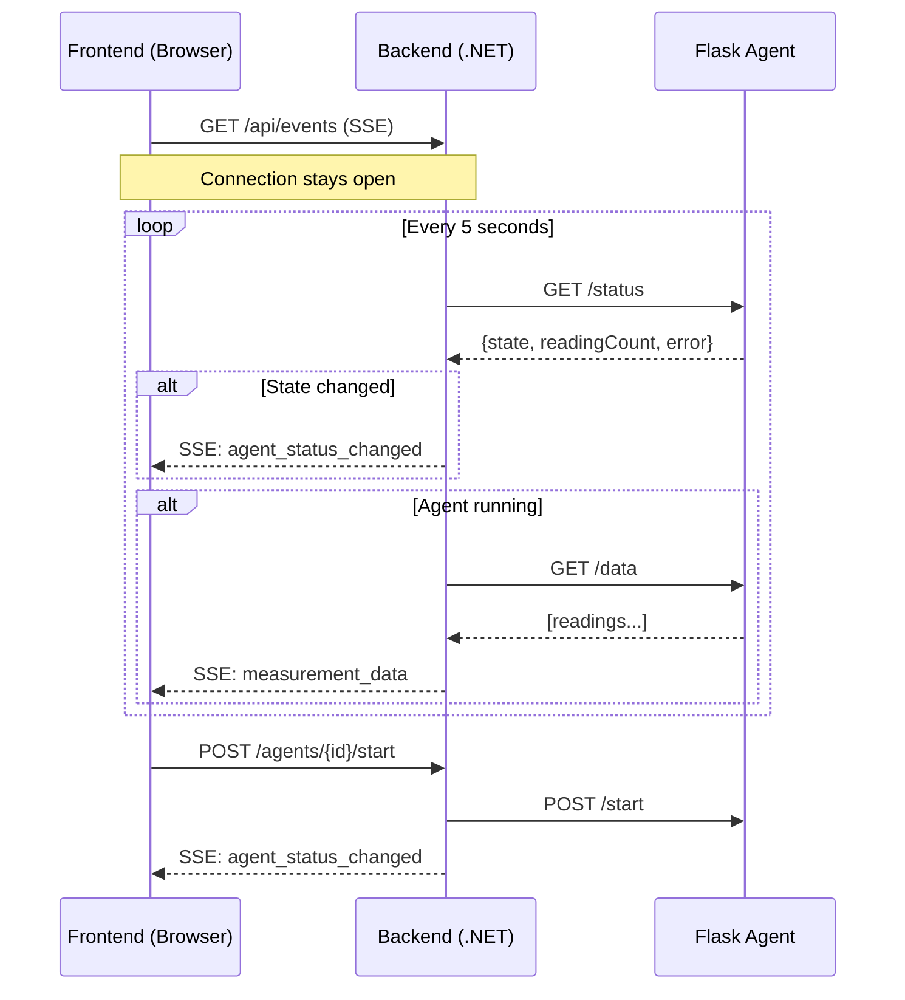
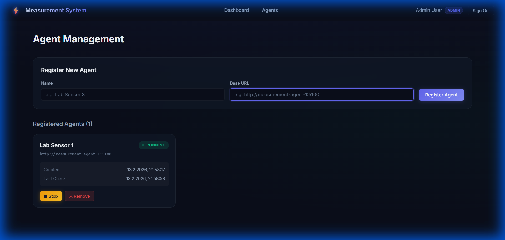
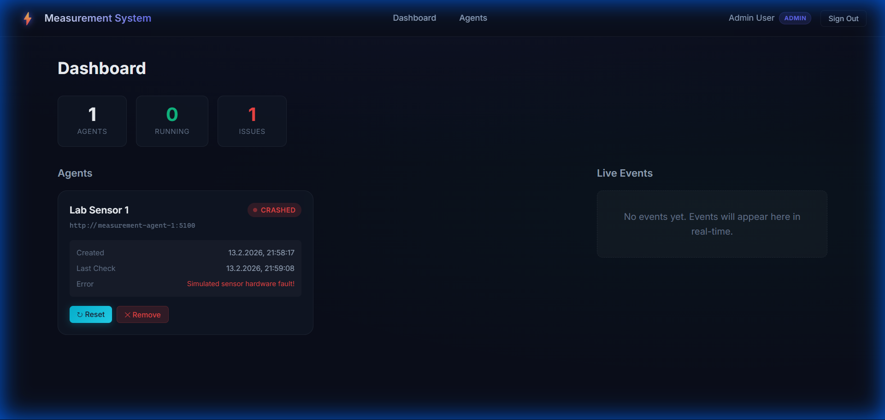

# Measurement System – Template Project

A full-stack template demonstrating a **measurement monitoring system** with:

- 🐍 **Flask Measurement Agents** – Simulated sensor devices that produce data and can crash
- ⚙️ **C# / .NET 9 Backend API** – Central orchestration with real-time SSE events
- ⚛️ **Next.js Frontend** – Dark-themed dashboard with live agent monitoring
- 🔐 **Keycloak** – OIDC authentication with role-based access (admin / viewer)
- 🐳 **Docker Compose** – One command to start the entire stack

## Quick Start

```bash
docker compose up --build
```

Then open:

| Service | URL |
| --------- | ----- |
| **Frontend** | [http://localhost:3000](http://localhost:3000) |
| **Backend API** | [http://localhost:5000](http://localhost:5000) |
| **Keycloak Admin** | [http://localhost:8080](http://localhost:8080) |
| **Agent 1** | [http://localhost:5100](http://localhost:5100/status) |
| **Agent 2** | [http://localhost:5101](http://localhost:5101/status) |

## Test Users

| Username    | Password    | Role                                               |
| ----------- | ----------- | -------------------------------------------------- |
| `admin`     | `admin123`  | Full access (start/stop agents, register/remove)   |
| `viewer`    | `viewer123` | Read-only (view status and data)                   |

Keycloak admin console: `admin` / `admin`

## Architecture

```md
Browser → Next.js (3000)
             ↓ OIDC
          Keycloak (8080)
             ↓ JWT
          .NET API (5000)  ← SSE events → Browser
             ↓ REST
        Flask Agents (5100, 5101)
```

### Key Features

- **Live SSE feed** – Agent state changes are pushed to the frontend in real-time
- **Health monitoring** – Backend polls agents every 5s, detects crashes, broadcasts alerts
- **Crash simulation** – Agents have a configurable crash probability
- **Role-based access** – Admins can manage agents; viewers can only observe

## API Endpoints

| Method | Endpoint                 | Auth  | Description           |
| ------ | ------------------------ | ----- | --------------------- |
| GET    | `/api/agents`            | ✅    | List all agents       |
| POST   | `/api/agents`            | admin | Register a new agent  |
| DELETE | `/api/agents/{id}`       | admin | Remove an agent       |
| POST   | `/api/agents/{id}/start` | admin | Start measurement     |
| POST   | `/api/agents/{id}/stop`  | admin | Stop measurement      |
| POST   | `/api/agents/{id}/reset` | admin | Reset after crash     |
| GET    | `/api/agents/{id}/data`  | ✅    | Get latest readings   |
| GET    | `/api/events`            | ✅    | SSE event stream      |

## Project Structure

```md
├── docker-compose.yml
├── measurement-agent/      # Flask (Python)
├── backend/                # .NET 9 Web API (C#)
├── frontend/               # Next.js 15 (TypeScript)
└── keycloak/               # Realm configuration
```

## Development

### Flask Agent (standalone)

```bash
cd measurement-agent
pip install -r requirements.txt
python app.py
```

### .NET Backend (standalone)

```bash
cd backend
dotnet run --project Backend.Api
```

### Next.js Frontend (standalone)

```bash
cd frontend
npm install
npm run dev
```

## Walkthrough & Proof of Work

### System Architecture Flow

Real-time updates flow through the system using Server-Sent Events (SSE):



### Build Verification Results

All components have been verified with clean builds:

- ✅ **Backend (.NET 9)**: 0 errors, 0 warnings.
- ✅ **Frontend (Next.js 15)**: All routes compiled successfully.

### Visual Proof of Work

The following screenshots demonstrate the functional system after login, agent registration, and a simulated crash event.




## License

MIT – Use as a starting point for your own projects.
